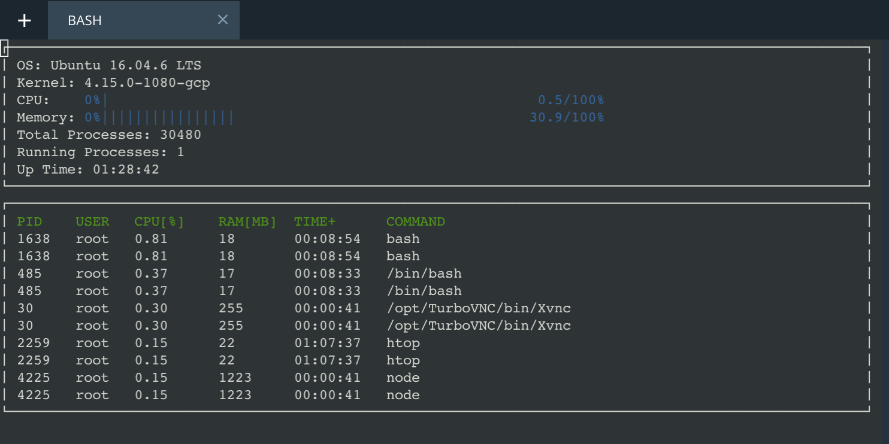

# system-monitor
A process monitor system that monitors all the active processes, with their corresponding process ids (PIDs), CPU usage, memory usage
## Background
### MS Process Minitor 
Process Monitor is an advanced monitoring tool for Windows that shows real-time file system, Registry and process/thread activity. It combines the features of two legacy Sysinternals utilities, Filemon and Regmon, and adds an extensive list of enhancements including rich and non-destructive filtering, comprehensive event properties such as session IDs and user names, reliable process information, full thread stacks with integrated symbol support for each operation, simultaneous logging to a file, and much more

* System Data
    * Linux stores a lot of system data in files within the `/proc` directory. 
* Operating System
    * Information about the operating system exists outside of the `/proc` directory, in the `/etc/os-release` file.
* Kernel
    * Information about the kernel exists `/proc/version` file.
* Memory Utilization
    * Information about memory utilization exists in the `/proc/meminfo` file.
    * [how htop calculates memory utilization from the data in `/proc/meminfo`](https://stackoverflow.com/questions/41224738/how-to-calculate-system-memory-usage-from-proc-meminfo-like-htop/41251290#41251290)
* Total Processes
    * Information about the total number of processes on the system exists in the `/proc/meminfo` file.
* Running Processes
    * Information about the number of processes on the system that are currently running exists in the `/proc/meminfo` file.
* Up Time
    * Information about system up time exists in the `/proc/uptime` file.

### Result: Run-time Environment 
* Build the project: `make build`
* Run the resulting executable: `./build/monitor`

The system monitor is reading the information from the system program and lists the operating system, kernel version, Total CPU utilization in a bar representation, Total memory utilization in a bar representation, total number of processes, number of running processes, and uptime. The system monitor displays the PID, user, CPU utilization, memory utilization, uptime, and command for each process.
-  display basic data about the system and individual processes
-  list at least the operating system, kernel version, total number of processes, number of running processes, and up tim
-  display the CPU utilization
-  display a partial list of processes running on the system
-  display the PID, user, CPU utilization, memory utilization, up time, and command for each process.
-  sory by CPU utilization and display PIDs according to sorted CPU utilization (high --> low) 

### TBD
- Calculate CPU utilization dynamically, based on recent utilization
- Sort processes(Pids) based on memory utilization as an optional choice(currently sort by CPU utilization)
- Make the display interactive
- Restructure the program to use abstract classes (interfaces) and pure virtual functions
- Port the program to another operating system(currently Linux) 

#### ncurses
- [ncurses](https://www.gnu.org/software/ncurses/) is a library that facilitates text-based graphical output in the terminal. 
- This project relies on ncurses for display output.

## Reference
- [MS Process Monitor](https://docs.microsoft.com/en-us/sysinternals/downloads/procmon)
- [Mac Activity Monitor](https://support.apple.com/guide/activity-monitor/welcome/mac)
- [Linux Top](https://man7.org/linux/man-pages/man1/top.1.html)
- [ncurses](https://www.gnu.org/software/ncurses/) 

